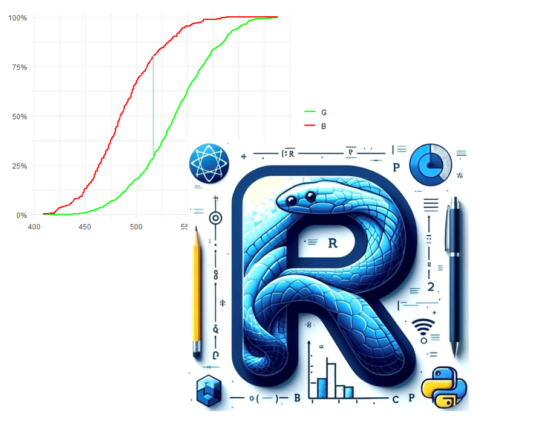

# Applied Data Science for Credit Risk

This repository is dedicated to my book 📕 [𝐀𝐩𝐩𝐥𝐢𝐞𝐝 𝐃𝐚𝐭𝐚 𝐒𝐜𝐢𝐞𝐧𝐜𝐞 𝐟𝐨𝐫 𝐂𝐫𝐞𝐝𝐢𝐭 𝐑𝐢𝐬𝐤: 𝗔 𝗣𝗿𝗮𝗰𝘁𝗶𝗰𝗮𝗹 𝗚𝘂𝗶𝗱𝗲 𝗶𝗻 𝗥 𝗮𝗻𝗱 𝗣𝘆𝘁𝗵𝗼𝗻](https://leanpub.com/adsfcr) and other topics related to credit risk modeling. It will be regularly updated with GitHub pages, slides, and PDF documents covering various modeling subjects.

The motivation behind writing this book and creating the repository stems from the observed gap between academic literature, industry practices, and the evolving landscape of data science. While there's been a notable increase in literature on credit risk modeling, discrepancies persist.  The evolution of data science has led to significant automation in processes. Still, it has also brought the risk of overreliance on pre-programmed procedures, sometimes leading to the misuse of statistical methods.
Moreover, many practitioners entering credit risk modeling often overlook fundamental principles, hindering their professional development. Hence, the repository aims to serve as a centralized hub for continuous education and consolidating essential concepts.

The repository and book will encompass practical examples utilizing both `R` and `Python`.

Below are links providing an overview of the repository's main topics, which include summaries from the book and insights gleaned from practical experience.

<b>The Vasicek Distribution (Probability of Default Models)</b>:
- [The Functional Form and Parameters Estimation Methods (pdf, presentation)](https://github.com/andrija-djurovic/adsfcr/blob/main/vasicek_distribution/vasicek_distribution.pdf)
- [Shiny Application for Estimating the Parameters of the Vasicek Distribution](https://andrijadj.shinyapps.io/vasicek_distribution/)
- [Asset Correlation Estimation - Maximum Likelihood: Analytical vs Numerical Optimization Approach (pdf, presentation)](https://github.com/andrija-djurovic/adsfcr/blob/main/vasicek_distribution/imm_vs_mle.pdf)
- [The Logistic Vasicek Distribution (pdf, presentation)](https://github.com/andrija-djurovic/adsfcr/blob/main/vasicek_distribution/logistic_vasicek_distribution.pdf)
- [Asset Correlation Estimation - Maximum Likelihood: Normal vs Logistic Vasicek Distribution (pdf, presentation)](https://github.com/andrija-djurovic/adsfcr/blob/main/vasicek_distribution/rho_normal_vs_logistic_vasicek.pdf)
- [Asset Correlation Estimators and Bias Quantification (pdf, presentation)](https://github.com/andrija-djurovic/adsfcr/blob/main/vasicek_distribution/rho_bias_quantification.pdf)
- [The Vasicek PD Model and Transition Matrices - Optimization of the Systemic Factor Z (pdf, presentation)](https://github.com/andrija-djurovic/adsfcr/blob/main/vasicek_distribution/tr_and_z_factor.pdf)

<b>Loss Given Default</b>:
- [Loss Given Default as a Function of the Default Rate (pdf, presentation)](https://github.com/andrija-djurovic/adsfcr/blob/main/lgd/lgd_as_a_function_of_dr.pdf)
- [The Vasicek LGD Model - The Functional Form and Parameters Estimation Method (pdf, presentation)](https://github.com/andrija-djurovic/adsfcr/blob/main/lgd/vasicek_lgd.pdf)
- [The Vasicek LGD Model - Simulating the Distribution of the Parameters (pdf, presentation)](https://github.com/andrija-djurovic/adsfcr/blob/main/lgd/vasicek_lgd_params_dist.pdf)
- [The Vasicek LGD Model - The Bias Quantification of the Sensitivity Parameter (pdf, presentation)](https://github.com/andrija-djurovic/adsfcr/blob/main/lgd/vasicek_lgd_q_bias_quant.pdf)

<b>Low Default Portfolios</b>:
- [Likelihood Approaches to Low Default Portfolios - Andrija Djurovic's Adjustment of Alan Forrest's Method to the Multi-Year Period Design (pdf, presentation)](https://github.com/andrija-djurovic/adsfcr/blob/main/ldp/ldp_adj_af_adjustment.pdf)
    - [R code (functions)](https://github.com/andrija-djurovic/adsfcr/blob/main/ldp/ldp_adj_af_multi_year.R)
    - [Python code (functions)](https://github.com/andrija-djurovic/adsfcr/blob/main/ldp/ldp_adj_af_multi_year.py)
- [Conservative Estimation of Default Probabilities - Benjamin-Cathcart-Ryan Approach (pdf presentation, `R` & `Python` code)](https://github.com/andrija-djurovic/adsfcr/blob/main/ldp/bcr.pdf)
    - [Simulation dataset](https://andrija-djurovic.github.io/adsfcr/ldp/BCR_TABLES.xlsx)
    - [R code (data & functions)](https://github.com/andrija-djurovic/adsfcr/blob/main/ldp/bcr.R)
    - [Python code (data & functions)](https://github.com/andrija-djurovic/adsfcr/blob/main/ldp/bcr.py)

<b>Measuring Concentration Risk</b>:
- [Measuring Concentration Risk - A Partial Portfolio Approach (pdf presentation, `R` & `Python` code)](https://github.com/andrija-djurovic/adsfcr/blob/main/concentration_risk/cr.pdf)
- [Simulation dataset](https://raw.githubusercontent.com/andrija-djurovic/adsfcr/main/concentration_risk/db.csv)

<b>Model Risk Management</b>:
- [Model Shift and Model Risk Management (pdf, presentation)](https://github.com/andrija-djurovic/adsfcr/blob/main/mrm/ms_mrm.pdf)
- [The Instability of WoE Encoding in PD Modeling (pdf, presentation)](https://github.com/andrija-djurovic/adsfcr/blob/main/mrm/pd_and_woe_encoding_instability.pdf)
- [Discriminatory Power Shortfalls in IRB Credit Risk Models - Risk-Weighted Assets Impact Analysis (pdf, presentation)](https://github.com/andrija-djurovic/adsfcr/blob/main/mrm/dp_shortfall_and_rwa_impact_analysis.pdf)
- [The Economic Value of Credit Rating Systems - Quantifying the Benefits of Improving an Internal Credit Rating System (pdf, presentation)](https://github.com/andrija-djurovic/adsfcr/blob/main/mrm/evrs.pdf)
- [Heterogeneity Shortfalls in IRB Credit Risk Models - Risk-Weighted Assets Impact Analysis (pdf, presentation)](https://github.com/andrija-djurovic/adsfcr/blob/main/mrm/heterogeneity_shortfall_and_rwa_impact_analysis.pdf)
- [Heterogeneity Shortfalls in IRB Credit Risk Models - Portfolio Returns Impact Analysis (pdf, presentation)](https://github.com/andrija-djurovic/adsfcr/blob/main/mrm/heterogeneity_shortfall_and_portfolio_returns.pdf)
  
<b>Model Development and Validation</b>:
- [Common Inconsistencies in Probability of Default Modeling (pdf, presentation)](https://github.com/andrija-djurovic/adsfcr/blob/main/model_dev_and_vld/pd_modeling_inconsistencies.pdf)
- [IRB PD Periodic Model Validation - Quantitative Testing Procedures (pdf, presentation)](https://github.com/andrija-djurovic/adsfcr/blob/main/model_dev_and_vld/periodic_pd_vld.pdf)
- [IRB Model Validation - Technical Aspects of Automated Reports (pdf,`R` & `Python` code)](https://github.com/andrija-djurovic/adsfcr/blob/main/model_dev_and_vld/vld_report_example.pdf)
- [Validation of Credit Risk Models - Does the P-value Provides Sufficient Insight? (pdf, presentation)](https://github.com/andrija-djurovic/adsfcr/blob/main/model_dev_and_vld/vld_and_p_value.pdf)
- [Validation of Credit Risk Models - On Favorable P-values in Statistical Tests (pdf, presentation)](https://github.com/andrija-djurovic/adsfcr/blob/main/model_dev_and_vld/favorable_p_value.pdf)
- [Margin of Conservatism Type C in PD Modeling - Central Tendency Uncertainty in the Presence of Autocorrelation (pdf, presentation)](https://github.com/andrija-djurovic/adsfcr/blob/main/model_dev_and_vld/moc_type_c_ct_autocorrelation.pdf)
- [Time Series Analysis in Credit Risk Modeling - OLS vs Yule-Walker Estimator for Autoregressive Coefficients (pdf, presentation)](https://github.com/andrija-djurovic/adsfcr/blob/main/model_dev_and_vld/aet.pdf)
- [Hypothesis Testing in Credit Risk - A Visual Approach for Deeper Understanding (pdf, presentation)](https://github.com/andrija-djurovic/adsfcr/blob/main/model_dev_and_vld/visual_support_for_ht.pdf)
- [On Testing the Concentration in the Rating Grades - The Initial and Periodic PD Model Validation (pdf, presentation)](https://github.com/andrija-djurovic/adsfcr/blob/main/model_dev_and_vld/hi_cv_testing.pdf)
- [The Binomial Tests for PD Model Validation - The Independent and Correlated Binomial Distributions (pdf, presentation)](https://github.com/andrija-djurovic/adsfcr/blob/main/model_dev_and_vld/independent_correlated_binomial_test.pdf)
- [The Model-Based Heterogeneity Testing (pdf, presentation)](https://github.com/andrija-djurovic/adsfcr/blob/main/model_dev_and_vld/model_based_heterogeneity_testing.pdf)
- [Risk-Weighted Assets as a Function of Probability of Default (pdf, presentation)](https://github.com/andrija-djurovic/adsfcr/blob/main/model_dev_and_vld/rwa_pd.pdf)
- [Principal Component Analysis for IFRS9 Forward-Looking Modeling (pdf presentation, `R` & `Python` code)](https://github.com/andrija-djurovic/adsfcr/blob/main/model_dev_and_vld/pca.pdf)
- [Bootstrap Hypothesis Tests (html, GitHub page)](https://andrija-djurovic.github.io/adsfcr/model_dev_and_vld/bootstrap_ht.html)
- [Bootstrap Hypothesis Tests (pdf, presentation)](https://github.com/andrija-djurovic/adsfcr/blob/main/model_dev_and_vld/bootstrap_ht.pdf)
- [Statistical Binning of Numeric Risk Factors - PD Modeling (pdf, presentation)](https://github.com/andrija-djurovic/adsfcr/blob/main/model_dev_and_vld/nrf_binning.pdf)
- [Statistical Binning and Model Validation - How the Choice of Binning Algorithm Influences Model Validation (pdf presentation, `R` & `Python` code)](https://github.com/andrija-djurovic/adsfcr/blob/main/model_dev_and_vld/binning_and_validation.pdf)
- [Hosmer-Lemeshow VS Z-score Test on Portfolio Level (html, GitHub slides)](https://andrija-djurovic.github.io/adsfcr/model_dev_and_vld/hl_vs_zscore.html#/)
- [Hosmer-Lemeshow VS Z-score Test on Portfolio Level (pdf, presentation)](https://github.com/andrija-djurovic/adsfcr/blob/main/model_dev_and_vld/hl_vs_zscore.pdf)
- [Power Play: Probability of Default Predictive Ability Testing (pdf, presentation)](https://github.com/andrija-djurovic/adsfcr/blob/main/model_dev_and_vld/statistical_power_of_pd_pp_tests.pdf)
- [Nested Dummy Encoding (pdf, presentation)](https://github.com/andrija-djurovic/adsfcr/blob/main/model_dev_and_vld/nested_dummy_encoding.pdf)
- [Marginal Information Value (pdf, presentation)](https://github.com/andrija-djurovic/adsfcr/blob/main/model_dev_and_vld/marginal_information_value.pdf)

<b>OLS Regression</b>:
- [Consequences of Violating the Normality Assumption for OLS Regression (pdf, `R` & `Python` code)](https://github.com/andrija-djurovic/adsfcr/blob/main/ols/normality.pdf)
- [Consequences of Heteroscedasticity for OLS Regression  (pdf, `R` & `Python` code)](https://github.com/andrija-djurovic/adsfcr/blob/main/ols/heteroscedasticity.pdf)
- [Consequences of Multicollinearity for OLS Regression  (pdf, `R` & `Python` code)](https://github.com/andrija-djurovic/adsfcr/blob/main/ols/multicollinearity.pdf)
- [Consequences of Autocorrelation for OLS Regression  (pdf, `R` & `Python` code)](https://github.com/andrija-djurovic/adsfcr/blob/main/ols/autocorrelation.pdf)

<b>Effective Interest Rate</b>:
- [Effective Interest Rate (html, `R` & `Python` code)](https://andrija-djurovic.github.io/adsfcr/effective_interest_rate/eir.html)
- [Effective Interest Rate (pdf, `R` & `Python` code)](https://github.com/andrija-djurovic/adsfcr/blob/main/effective_interest_rate/eir.pdf)

<b>Loan Repayment Plan</b>:
- [Loan Repayment Plan (html, `R` & `Python` code)](https://andrija-djurovic.github.io/adsfcr/loan_repayment_plan/lrp.html)
- [Loan Repayment Plan (pdf, `R` & `Python` code)](https://github.com/andrija-djurovic/adsfcr/blob/main/loan_repayment_plan/lrp.pdf)
